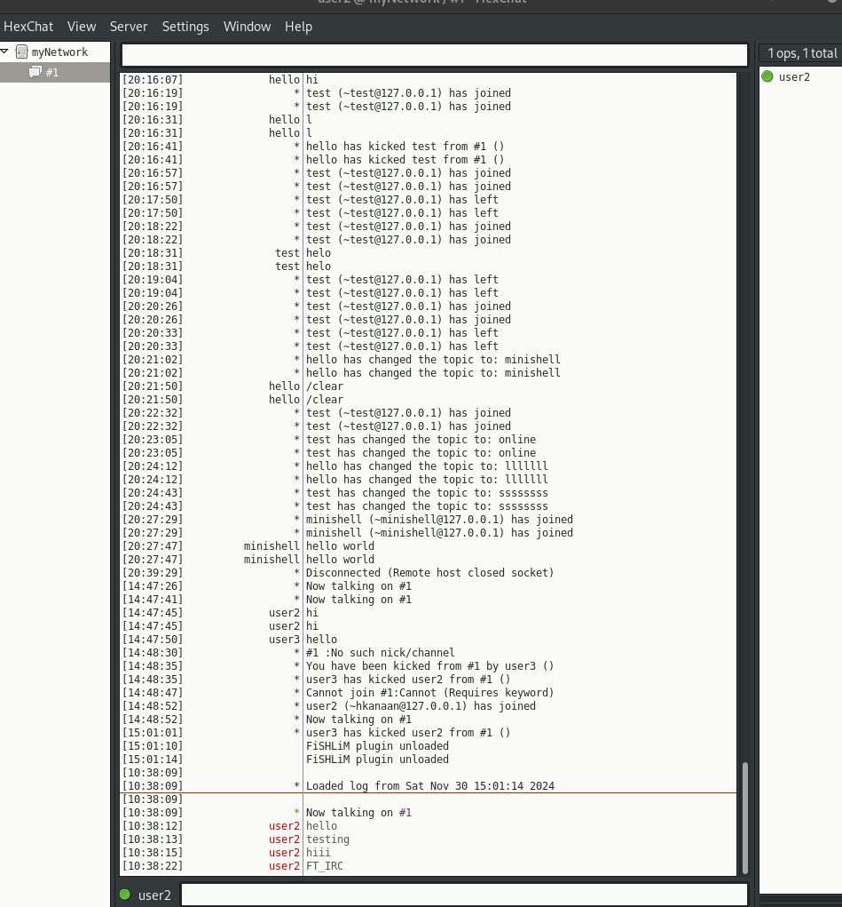
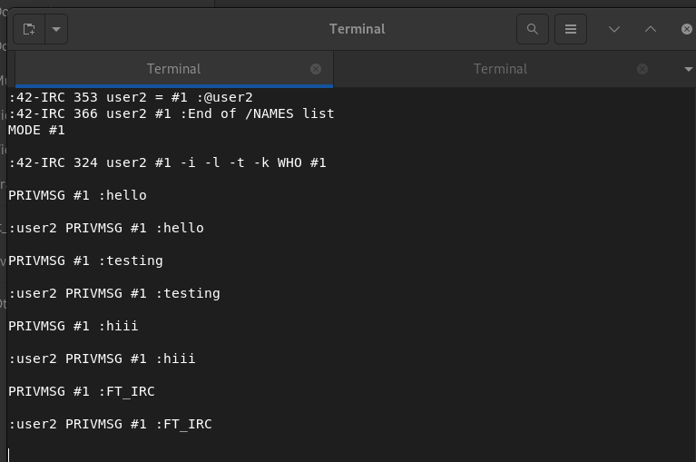

# ft_irc

## Overview
**ft_irc** is a project focused on building a functional IRC (Internet Relay Chat) server. This server implements essential IRC functionality, enabling multiple clients to connect and communicate in real-time. The project adheres to the IRC protocol and uses non-blocking I/O operations to ensure efficient handling of multiple clients simultaneously.

---

## Screenshots





## Features

### Mandatory Features
- **Multi-Client Support**:
  - Handles multiple clients concurrently using non-blocking I/O.
  - Ensures no system hangs or crashes under load.

- **TCP/IP Communication**:
  - Communication between the server and clients is established over the TCP/IP protocol (IPv4 or IPv6).

- **Authentication**:
  - Clients must provide the correct password upon connection to authenticate.

- **IRC Commands**:
  - **NICK**: Set a nickname for the client.
  - **USER**: Set a username for the client.
  - **JOIN**: Join a channel.
  - **PRIVMSG**: Send private messages to users or channels.
  - **PART**: Leave a channel.

- **Channel Functionality**:
  - Messages sent in a channel are broadcasted to all members of the channel.
  - Operators and regular users are distinguished.

- **Operator-Specific Commands**:
  - **KICK**: Eject a client from a channel.
  - **INVITE**: Invite a client to a channel.
  - **TOPIC**: View or change the channel topic.
  - **MODE**: Modify channel settings:
    - `i`: Invite-only mode.
    - `t`: Restrict topic changes to operators.
    - `k`: Set/remove a channel key (password).
    - `o`: Grant/revoke operator privileges.
    - `l`: Set/remove user limit for the channel.

- **Non-Blocking I/O**:
  - Utilizes `poll()` (or equivalent) for handling all I/O operations, ensuring high efficiency.

- **Clean Code**:
  - Adheres to the C++98 standard.
  - Compiled with `-Wall -Wextra -Werror`.

---

## How to Use

### Prerequisites
- A C++98-compliant compiler.
- An IRC client to test the server (e.g., HexChat, irssi, or nc for basic testing).

### Compilation
To compile the project, run:
```bash
make
```

This will create the `ircserv` executable.

### Running the Server
Run the server with the following command:
```bash
./ircserv <port> <password>
```
- **port**: The port number on which the server will listen for incoming connections.
- **password**: The password clients need to provide for authentication.

### Testing the Server
1. Connect to the server using an IRC client:
   ```bash
   nc -C 127.0.0.1 <port>
   ```
2. Use commands like `NICK`, `USER`, `JOIN`, `PRIVMSG`, and others to interact with the server.

---

## File Structure
- **Source Files**:
  - `.cpp` files for the implementation of server logic and IRC command handling.
- **Header Files**:
  - `.hpp` files for class definitions and constants.
- **Makefile**:
  - Automates the build process with rules for `all`, `clean`, `fclean`, and `re`.

---

## Example Commands
Here are some example commands you can use to interact with the server:

1. **Set a Nickname**:
   ```
   NICK myNickname
   ```
2. **Set a Username**:
   ```
   USER myUsername 0 * :My Real Name
   ```
3. **Join a Channel**:
   ```
   JOIN #myChannel
   ```
4. **Send a Message to a Channel**:
   ```
   PRIVMSG #myChannel :Hello, everyone!
   ```
5. **Leave a Channel**:
   ```
   PART #myChannel
   ```
6. **Send a Private Message**:
   ```
   PRIVMSG anotherUser :Hi there!
   ```

---

## Known Limitations
- Server-to-server communication is not implemented.
- Advanced IRC features (e.g., file transfers or bots) are not included in this implementation.

---

## Credits
- Developed as part of the 42 School curriculum.

Thank you for reviewing the ft_irc project!

